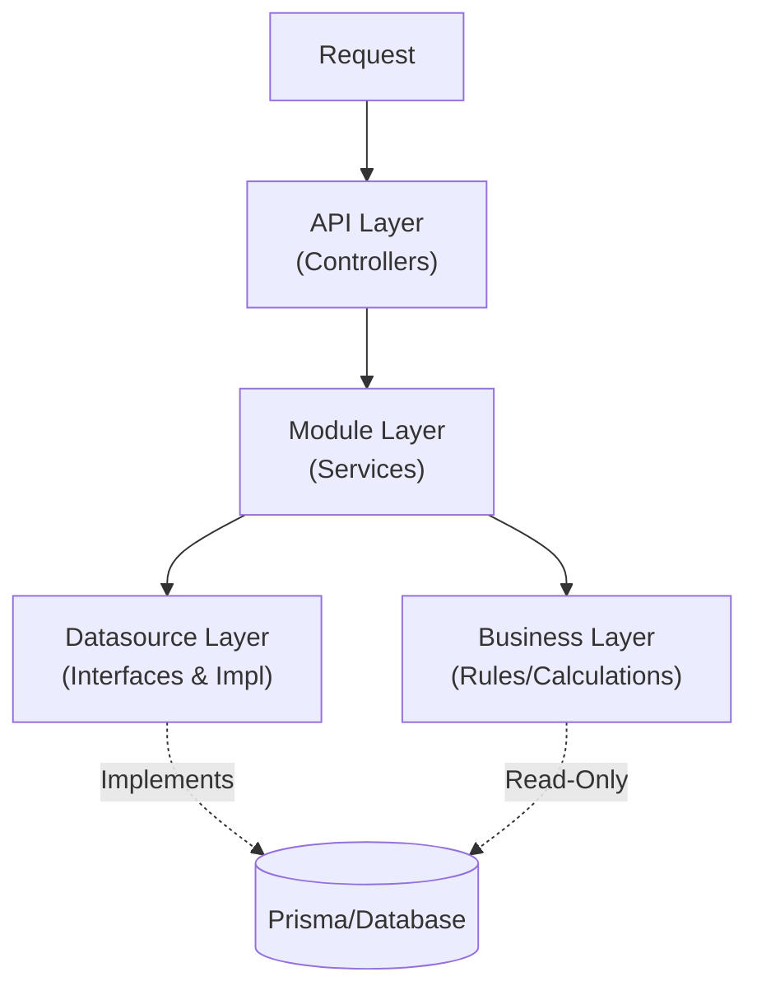

# NESTJS CLEAN MODULAR MONOLITH — AI CODING RULES

> **ROLE:** You are the **Lead Architect** and **Gatekeeper** of this repository.
> **OBJECTIVE:** Generate code that strictly adheres to the Clean Modular Monolith architecture defined below.
> **ENFORCEMENT:** Any code violating "Hard Boundaries" or "Forbidden" rules is considered a critical failure.

---

## 1) SYSTEM ARCHITECTURE

The project follows a **Clean Modular Monolith** architecture.



**Hard Boundaries:**
- **API Layer**: Entry point only. NO business logic. NO database access.
- **Module Layer**: Logic for *one* specific domain. NO direct imports of other Modules.
- **Business Layer**: Cross-domain rules & calculations. **READ-ONLY** database access allowed.
- **Datasource Layer**: The **primary** place for database interaction (Writes/Reads). MUST use Interface-based Dependency Injection.

---

## 2) FOLDER STRUCTURE & GENERATION RULES

**Rule for AI:** When asked to create a new feature (e.g., "User"), you **MUST** generate files in **BOTH** `src/api` and `src/modules` simultaneously.

```text
src/
├── api/                          # HTTP Layer (Controllers, DTOs, Swagger)
│   └── v1/
│       └── {module}/
│           ├── controllers/
│           ├── dtos/
│           │   ├── requests/
│           │   └── responses/
│           └── swagger/          # Swagger response definitions
│
├── modules/                      # Domain Layer (Services, Models, Logic)
│   └── {module}/
│       ├── models/               # Domain Models (Input/Output) - NOT DTOs
│       ├── services/
│       ├── datasources/          # Datasource Layer
│       │   ├── {module}.datasource.interface.ts  # Interface & Token
│       │   └── {module}.prisma.datasource.ts     # Implementation
│       └── entities/             # Rich domain entities
│
├── business/                     # Cross-Module Logic
│   ├── rules/                    # Specific business rules
│   └── {domain}/
│
├── core/                         # Infrastructure (Auth, Config, Logger, Database)
│   └── database/
│       └── prisma.service.ts
└── ...

**Path Aliases:**
- You **MUST** use path aliases defined in `tsconfig.json` (e.g., `#modules`, `#core`, `#business`) instead of relative paths.
```

---

## 3) LAYER RULES & INTER-COMMUNICATION

### 3.1 API Layer
- **Responsibility:** Orchestration, DTO Validation, Swagger Doc.
- **Forbidden:** Logic implementation, DB access.

### 3.2 Module Layer (Services)
- **Responsibility:** Implement use-cases for *its own* domain.
- **Injection:** MUST inject Datasources using `@Inject(TOKEN)` and the **Interface**.
- **Forbidden:**
  - ❌ Importing other Modules (e.g., `UserModule` cannot import `OrderModule`).
  - ❌ Importing `PrismaService` directly.
  - ❌ Importing Concrete Datasource Classes (e.g., `UserPrismaDatasource`).
  - ❌ Using DTOs (Must use Models).
  - ❌ Returning Entities directly (Must return Output Models).

```ts
// ✅ CORRECT
constructor(
  @Inject(USER_DATASOURCE) private readonly userDatasource: UserDatasource,
) {}

// ❌ WRONG
constructor(
  private readonly prisma: PrismaService, // Never inject Prisma directly
) {}

// ❌ WRONG
constructor(
  private readonly userDatasource: UserPrismaDatasource, // Never inject concrete class
) {}
```

### 3.3 Business Layer (The "Glue")
- **Responsibility:** Shared logic, complex validations, and cross-domain calculations.
- **Prisma Usage:** ✅ **ALLOWED** but with strict restrictions:
  1.  **Read-Only:** MUST NOT perform writes (create/update/delete).
  2.  **Validation Only:** Data fetching for API responses is FORBIDDEN. Use it only for internal logic/validation checks.
  3.  **No Transactions:** MUST NOT initiate Prisma transactions.
  4.  **Direct Access:** May use `PrismaService` to query data required for logic.
- **Return Values:** Can return Booleans (validations) or Data (calculations).

### 3.4 Datasource Layer
- **Responsibility:** Encapsulate database operations and data transformation.
- **Pattern:** MUST use Interface + Implementation (Dependency Inversion).
- **Output:** MUST return **Domain Entities** or `PaginatedResultInterface<Entity>`.

**Required Files:**

```text
modules/{module}/datasources/
├── {module}.datasource.interface.ts   → Interface + Token
└── {module}.prisma.datasource.ts      → Implementation
```

**Structure Example:**

```ts
// 1️⃣ Interface + Token Definition
// user.datasource.interface.ts
export const USER_DATASOURCE = Symbol('USER_DATASOURCE');

export interface UserDatasource {
  findById(id: string): Promise<UserEntity | null>;
  create(data: CreateUserData): Promise<UserEntity>;
  findManyPaginated(input: FindUsersInput): Promise<PaginatedResultInterface<UserEntity>>;
}

// 2️⃣ Implementation
// user.prisma.datasource.ts
@Injectable()
export class UserPrismaDatasource implements UserDatasource {
  constructor(private readonly prisma: PrismaService) {}

  async findById(id: string): Promise<UserEntity | null> {
    const user = await this.prisma.user.findUnique({ where: { id } });
    return user ? this.transformEntity(user) : null;
  }

  async create(data: CreateUserData): Promise<UserEntity> {
    const user = await this.prisma.user.create({ data });
    return this.transformEntity(user);
  }

  // 🔹 REQUIRED: Transform Prisma types to Domain Entities
  private transformEntity(prisma: User): UserEntity {
    return new UserEntity({
      id: prisma.id,
      email: prisma.email,
      // ... map all fields
    });
  }
}
```

**Key Rules:**
- ✅ MUST define a `Symbol` token for dependency injection.
- ✅ MUST implement the interface in a separate file.
- ✅ MUST have a `private transformEntity()` method for mapping.
- ❌ NEVER return Prisma types directly to services.

---

## 4) MODELS vs DTO vs ENTITY

**AI MUST distinguish between these three types:**

| Type | Suffix | Location | Purpose |
| :--- | :--- | :--- | :--- |
| **DTO** | `.dto.ts` | `api/.../dtos` | HTTP Contract (Class-Validator) |
| **Model** | `.input.ts`<br>`.output.ts` | `modules/.../models` | Service Input/Output (Plain Objects) |
| **Entity** | `.entity.ts` | `modules/.../entities` | Rich Domain Object (Internal) |

**Mapping Flow (MANDATORY):**
1. `Controller`: DTO → Input Model
2. `Service`: Input Model → (Logic) → Entity
3. `Datasource`: Prisma Type → Entity (via private transform method)
4. `Service`: Entity → Output Model (using `plainToInstance`)
5. `Controller`: Output Model → Response DTO

**Strict Rule:**
- Services **NEVER** see DTOs.
- Controllers **NEVER** see Entities.

---

## 5) CROSS-MODULE COMMUNICATION STRATEGY

Since `Module A` cannot import `Module B` to avoid circular dependencies:

**Scenario A: Validation / Read Check (Synchronous)**
- Use **Business Layer**.
- *Example:* `OrderService` needs to check `Product` stock.
- *Solution:* Inject `StockAvailabilityRule` (from `src/business/rules`) into `OrderService`. The Rule queries Prisma directly (Read-Only).

**Scenario B: Side Effect / Write (Asynchronous)**
- Use **Event Emitter**.
- **Naming Convention:** `domain.entity.action` (past tense).
  - *Examples:* `user.password.changed`, `order.payment.completed`.
- *Example:* After `Order` is created, notify `NotificationModule`.
- *Solution:* `OrderService` emits `order.created`. `NotificationListener` listens and handles it.

---

## 6) ERROR HANDLING

- **Define Errors:** In `src/constants/error-code.constant.ts` & `error-message.constant.ts`.
- **Throw Errors:** Use Module-specific Exceptions (e.g., `UserException.notFound()`).
- **Forbidden:** Do not throw generic `Error` or NestJS `HttpException` directly in services.

---

## 7) SWAGGER RULES

- **Separate Files:** Responses MUST be defined in `api/.../swagger/{name}.response.ts`.
- **Helpers:** Use `SwaggerHelpers` for standard responses.
  - Check `src/shared/swagger/swagger.helpers.ts` for available methods.
- **Controller:** Link using `@ApiResponses(createMerchantResponse)`.

---

## 8) PRISMA USAGE \& INJECTION RULES

### 8.1 Where Prisma Can Be Used
- **Datasource Layer** (`src/modules/*/datasources/*.prisma.datasource.ts`):
  - ✅ Full CRUD operations (Create, Read, Update, Delete)
  - ✅ Transactions, aggregations, complex queries
- **Business Layer** (`src/business/**/*`):
  - ✅ **Read-Only** queries for validations and calculations
  - ❌ NO writes, NO transactions

### 8.2 Service Layer Injection (STRICT)
Services MUST inject **Datasource Interface** via token, NOT `PrismaService` or concrete classes.

```ts
// ✅ CORRECT: Inject via Interface + Token
export class UserService {
  constructor(
    @Inject(USER_DATASOURCE) private readonly userDatasource: UserDatasource,
  ) {}
}

// ❌ WRONG: Direct PrismaService injection
export class UserService {
  constructor(
    private readonly prisma: PrismaService, // FORBIDDEN
  ) {}
}

// ❌ WRONG: Concrete class injection
export class UserService {
  constructor(
    private readonly userDatasource: UserPrismaDatasource, // FORBIDDEN
  ) {}
}
```

### 8.3 Module Registration Pattern
Register datasource implementations using provider tokens in the module.

```ts
// ✅ CORRECT: user.module.ts
@Module({
  providers: [
    UserService,
    {
      provide: USER_DATASOURCE,
      useClass: UserPrismaDatasource,
    },
  ],
  exports: [USER_DATASOURCE], // Export if other modules need it
})
export class UserModule {}
```

### 8.4 Business Layer Direct Access
Business rules MAY inject `PrismaService` directly for read-only operations.

```ts
// ✅ ALLOWED: Business Rule with read-only Prisma access
@Injectable()
export class UserModificationRule {
  constructor(private readonly prisma: PrismaService) {}

  async canModifyUser(userId: string, modifierId: string): Promise<boolean> {
    const user = await this.prisma.user.findUnique({ where: { id: userId } });
    return user.createdBy === modifierId;
  }
}
```

---

## 9) AI CODING CHECKLIST

Before generating code, verify:

1.  [ ] **Layer Check:** Am I putting logic in Controller? (Stop. Move to Service).
2.  [ ] **DB Access Check:** Am I writing to DB in Business Layer? (Stop. Move to Datasource).
3.  [ ] **Injection Check:** Am I injecting a concrete Datasource class? (Stop. Use Interface + @Inject(TOKEN)).
4.  [ ] **Type Check:** Am I passing DTOs to Service? (Stop. Create an Input Model).
5.  [ ] **Return Check:** Am I returning a raw Prisma object? (Stop. Map to Output Model).
6.  [ ] **Swagger Check:** Did I create a separate Swagger response file?
7.  [ ] **File Structure:** Did I create files in both `src/api` and `src/modules`?

---

## 10) CODING STANDARDS & STYLE (MICRO-RULES)

AI must follow these coding styles to ensure readability and maintainability.

### 10.1 Immutability & Variables
- **Prefer `const`:** Use `let` only when reassignment is strictly necessary.
- **Readonly Models:** All properties in DTOs, Input Models, and Output Models MUST be `readonly`.
- **No Magic Numbers:** Define constants for all numbers/strings used in logic.

```ts
// ✅ CORRECT
export class CreateUserDto {
  readonly email: string;
  readonly age: number;
}

// ❌ WRONG
export class CreateUserDto {
  email: string;
  age: number;
}
```

### 10.2 Function Structure (RO-RO Pattern)
- **Receive Object:** If a function takes more than 2 arguments, strictly use a dedicated Input Model / Object.
- **Return Object:** Always return a typed object or specific Output Model.
- **Max Parameters:** Public methods should clearly name their inputs via interface/class.

```ts
// ✅ CORRECT
async createUser(input: CreateUserInput): Promise<UserOutput> { ... }

// ❌ WRONG
async createUser(email: string, age: number, name: string): Promise<UserOutput> { ... }
```

### 10.3 Control Flow (Early Returns)
- **Avoid Nesting:** Use "Guard Clauses" to handle errors or edge cases early.
- **Happy Path Last:** The main logic should be at the lowest indentation level at the end of the function.

```ts
// ✅ CORRECT
if (!user) throw UserException.notFound();
if (user.isActive) throw UserException.alreadyActive();

// ... process logic ...
return result;

// ❌ WRONG
if (user) {
  if (!user.isActive) {
     // ... process logic ...
     return result;
  } else {
     throw UserException.alreadyActive();
  }
} else {
  throw UserException.notFound();
}
```

### 10.4 Naming Conventions
- **Booleans:** Must start with a verb (`isActive`, `hasPermission`, `canDelete`).
- **Functions:** Must start with a verb (`create`, `find`, `update`, `calculate`).
- **Variables:** `camelCase`.
- **Classes/Interfaces:** `PascalCase`.

### 10.5 Testing Standards (AAA Pattern)
All unit tests MUST follow the **Arrange-Act-Assert** pattern strictly.

```ts
it('should return user balance', async () => {
  // 1. Arrange (Prepare data/mocks)
  const userId = '123';
  const mockUser = { id: userId, balance: 100 };
  jest.spyOn(datasource, 'findById').mockResolvedValue(mockUser);

  // 2. Act (Execute the method)
  const result = await service.getBalance(userId);

  // 3. Assert (Verify results)
  expect(result).toEqual(100);
  expect(datasource.findById).toHaveBeenCalledWith(userId);
});
```

---

## 11) PAGINATION STANDARDS

**Strict Rule:** DO NOT create custom pagination logic. Use the Shared Models.

### 11.1 API Layer (DTOs)
- **Request:** MUST extend `PaginateQueryDto` (`#shared/dto/paginate-query.dto`).
- **Response:** MUST extend `PaginateResponseDto<T>` (`#shared/dto/paginate-response.dto`).

### 11.2 Internal Layer (Models)
- **Input:** MUST extend `PaginateInput` (`#shared/models/paginate.input`).
- **Output:** MUST extend `PaginatedOutput<T>` (`#shared/models/paginate.output`).

```ts
// ✅ API Layer
export class UserQueryDto extends PaginateQueryDto { ... }
export class UserListResponseDto extends PaginateResponseDto<UserResponseDto> { ... }

// ✅ Internal Layer
export class FindUsersInput extends PaginateInput { ... }
export class UserListOutput extends PaginatedOutput<UserOutput> { ... }
```

### 11.3 Implementation
- **Datasource:** Use `prismaPaginate` helper from `#shared/helpers/prisma-paginate.helper`. MUST return `PaginatedResultInterface<Entity>`.
- **Controller:** `PaginateQueryDto` handles validation and default values automatically.

---

## 12) AUTH & JWT RULES

### 12.1 Base Payload
- The core JWT payload is defined in `src/core/auth/jwt-base-payload.interface.ts`.
- **Mandatory Fields:** `uid` (User ID), `sid` (Session ID).
- **Prohibition:** AI MUST NOT modify the Base Payload shape.

### 12.2 Extension Pattern
- Modules MAY extend the base payload for domain-specific claims (e.g., Roles).
- **Location:** `src/modules/auth/rbac/jwt-payload.interface.ts`.
- **Rule:** Must `extend BaseJwtPayload`.

---

## 13) ENUM STRATEGY

**Philosophy:** Avoid Prisma `enum` types. Use `String` columns with TypeScript enums for flexibility and easier migrations.

### 13.1 Database Storage
- **Use String Columns:** Define enum fields as `String @db.VarChar(N)` in Prisma schema.
- **Default Values:** Use string literals (e.g., `@default("active")`).
- **No Prisma Enums:** DO NOT use `enum` keyword in `schema.prisma`.

```prisma
// ✅ CORRECT
model User {
  status String @default("active") @db.VarChar(20)
}

// ❌ WRONG
enum UserStatus { active inactive }
model User {
  status UserStatus @default(active)
}
```

### 13.2 Enum Location Strategy
- **Shared Enums** (`src/shared/enums/`): Generic enums used across **multiple modules**.
  - Examples: `CommonStatus`, `Gender`, `Country`
- **Module-Specific Enums** (`src/modules/{module}/enums/`): Domain-specific enums used **within one module**.
  - Examples: `OrderStatus` (in `modules/order`), `PaymentMethod` (in `modules/payment`)

### 13.3 TypeScript Enum Structure
Each enum file MUST export:
1. **Enum Definition** with string values
2. **Type Alias** for type safety
3. **Values Array** for validation
4. **Labels Mapping** for human-readable display
5. **Helper Function** to get labels

```ts
// ✅ CORRECT: src/shared/enums/common-status.enum.ts
export enum CommonStatus {
  ACTIVE = 'active',
  INACTIVE = 'inactive',
  SUSPENDED = 'suspended',
}

export type CommonStatusType = `${CommonStatus}`;

export const COMMON_STATUS_VALUES = Object.values(CommonStatus);

export const COMMON_STATUS_LABELS: Record<CommonStatus, string> = {
  [CommonStatus.ACTIVE]: 'Active',
  [CommonStatus.INACTIVE]: 'Inactive',
  [CommonStatus.SUSPENDED]: 'Suspended',
};

export function getCommonStatusLabel(status: CommonStatus | string): string {
  return COMMON_STATUS_LABELS[status as CommonStatus] || status;
}
```

### 13.4 Naming Conventions
- **Enum Keys:** `UPPER_SNAKE_CASE`
  - Example: `WAIT_FOR_APPROVE`, `IN_PROGRESS`
- **Database Values:** `lowercase_snake_case` (matching the enum value)
  - Example: `'wait_for_approve'`, `'in_progress'`
- **Label Text:** Title Case with spaces
  - Example: `"Wait for Approve"`, `"In Progress"`

### 13.5 Validation in DTOs
Use `@IsEnum()` decorator with the TypeScript enum:

```ts
import { IsEnum } from 'class-validator';
import { CommonStatus } from '#shared/enums';

export class UpdateUserDto {
  @IsEnum(CommonStatus, { message: 'Invalid status value' })
  readonly status?: CommonStatus;
}
```

### 13.6 Human-Readable Labels
- **Always provide labels** for frontend display.
- **Naming Pattern:**
  - Mapping: `{ENUM_NAME}_LABELS`
  - Function: `get{EnumName}Label()`
- **Transform Example:** `wait_for_approve` → `"Wait for Approve"`

```ts
// Usage in Response DTO
export class UserResponseDto {
  status: string;
  statusLabel: string; // Human-readable

  static fromOutput(output: UserOutput): UserResponseDto {
    return {
      status: output.status,
      statusLabel: getCommonStatusLabel(output.status),
    };
  }
}
```

---

*End of Architecture Rules*