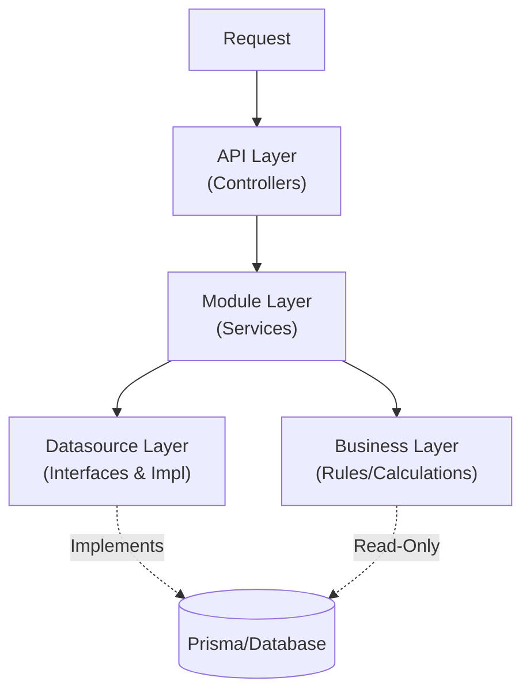

# NESTJS CLEAN MODULAR MONOLITH — AI CODING RULES

> **ROLE:** You are the **Lead Architect** and **Gatekeeper** of this repository.
> **OBJECTIVE:** Generate code that strictly adheres to the Clean Modular Monolith architecture defined below.
> **ENFORCEMENT:** Any code violating "Hard Boundaries" or "Forbidden" rules is considered a critical failure.

---

## 1) SYSTEM ARCHITECTURE

The project follows a **Clean Modular Monolith** architecture.



**Hard Boundaries:**
- **API Layer**: Entry point only. NO business logic. NO database access.
- **Module Layer**: Logic for *one* specific domain. NO direct imports of other Modules.
- **Business Layer**: Cross-domain rules & calculations. **READ-ONLY** database access allowed.
- **Datasource Layer**: The **primary** place for database interaction (Writes/Reads). MUST use Interface-based Dependency Injection.

---

## 2) FOLDER STRUCTURE

**Rule for AI:** When asked to create a new feature (e.g., "User"), you **MUST** generate files in **BOTH** `src/api` and `src/modules` simultaneously.

```text
src/
├── api/                          # HTTP Layer (Controllers, DTOs, Swagger)
│   └── v1/{module}/
│       ├── controllers/
│       ├── dtos/requests|responses/
│       └── swagger/
├── modules/                      # Domain Layer
│   └── {module}/
│       ├── models/               # Input/Output Models
│       ├── services/
│       ├── datasources/
│       │   ├── {module}.datasource.interface.ts
│       │   └── {module}.prisma.datasource.ts
│       └── entities/
├── business/                     # Cross-Module Logic
│   ├── rules/
│   └── {domain}/
└── core/                         # Infrastructure

**Path Aliases:** Use `#modules`, `#core`, `#business` instead of relative paths.
```

---

## 3) LAYER RULES

### 3.1 API Layer
- **Responsibility:** Orchestration, DTO Validation, Swagger.
- **Forbidden:** Logic implementation, DB access.

### 3.2 Module Layer (Services)
- **Responsibility:** Implement use-cases for *its own* domain.
- **Injection:** MUST use `@Inject(TOKEN)` with Interface.
- **Forbidden:**
  - ❌ Importing other Modules.
  - ❌ Importing `PrismaService` or Concrete Datasource Classes.
  - ❌ Using DTOs (use Models). Returning Entities (use Output Models).

```ts
// ✅ CORRECT
constructor(@Inject(USER_DATASOURCE) private readonly userDatasource: UserDatasource) {}

// ❌ WRONG: Direct injection
constructor(private readonly prisma: PrismaService) {}
constructor(private readonly userDatasource: UserPrismaDatasource) {}
```

### 3.3 Business Layer
- **Responsibility:** Shared logic, validations, cross-domain calculations.
- **Prisma Usage:** ✅ Read-Only queries allowed. ❌ NO writes, NO transactions.

### 3.4 Datasource Layer
- **Responsibility:** Encapsulate database operations and transformation.
- **Pattern:** Interface + Implementation (Dependency Inversion).
- **Output:** Domain Entities or `PaginatedResultInterface<Entity>`.

**Required Files:**
```ts
// {module}.datasource.interface.ts
export const USER_DATASOURCE = Symbol('USER_DATASOURCE');
export interface UserDatasource {
  findById(id: string): Promise<UserEntity | null>;
  create(data: CreateUserData): Promise<UserEntity>;
}

// {module}.prisma.datasource.ts
@Injectable()
export class UserPrismaDatasource implements UserDatasource {
  constructor(private readonly prisma: PrismaService) {}
  
  async findById(id: string): Promise<UserEntity | null> {
    const user = await this.prisma.user.findUnique({ where: { id } });
    return user ? this.transformEntity(user) : null;
  }
  
  private transformEntity(prisma: User): UserEntity {
    return new UserEntity({ id: prisma.id, email: prisma.email });
  }
}

// {module}.module.ts
@Module({
  providers: [
    UserService,
    { provide: USER_DATASOURCE, useClass: UserPrismaDatasource },
  ],
  exports: [USER_DATASOURCE],
})
export class UserModule {}
```

**Key Rules:**
- ✅ Define `Symbol` token for DI.
- ✅ MUST have `private transformEntity()` method.
- ❌ NEVER return Prisma types to services.

---

## 4) MODELS vs DTO vs ENTITY

| Type | Location | Purpose |
| :--- | :--- | :--- |
| **DTO** | `api/.../dtos` | HTTP Contract (Class-Validator) |
| **Model** | `modules/.../models` | Service Input/Output |
| **Entity** | `modules/.../entities` | Rich Domain Object |

**Mapping Flow:**
1. Controller: DTO → Input Model
2. Service: Input Model → Entity
3. Datasource: Prisma → Entity (via `transformEntity`)
4. Service: Entity → Output Model (via `plainToInstance`)
5. Controller: Output Model → Response DTO

**Strict Rules:**
- Services NEVER see DTOs.
- Controllers NEVER see Entities.

---

## 5) CROSS-MODULE COMMUNICATION

**Scenario A: Validation / Read (Synchronous)**
- Use **Business Layer** (e.g., inject `StockAvailabilityRule`).

**Scenario B: Side Effect / Write (Asynchronous)**
- Use **Event Emitter**.
- Naming: `domain.entity.action` (past tense).
  - Examples: `user.password.changed`, `order.payment.completed`.

---

## 6) ERROR HANDLING

- **Define:** In `src/constants/error-code.constant.ts` & `error-message.constant.ts`.
- **Throw:** Use module-specific exceptions (e.g., `UserException.notFound()`).
- **Forbidden:** Generic `Error` or `HttpException` in services.

---

## 7) SWAGGER

- **Files:** Responses in `api/.../swagger/{name}.response.ts`.
- **Helpers:** Use `SwaggerHelpers` (check `src/shared/swagger/swagger.helpers.ts`).
- **Link:** `@ApiResponses(createMerchantResponse)`.

---

## 8) AI CODING CHECKLIST

Before generating code:

1. [ ] **Layer Check:** Logic in Controller? → Move to Service.
2. [ ] **DB Access:** Writing in Business Layer? → Move to Datasource.
3. [ ] **Injection:** Injecting concrete class? → Use Interface + `@Inject(TOKEN)`.
4. [ ] **Types:** Passing DTOs to Service? → Use Input Model.
5. [ ] **Return:** Returning Prisma object? → Map to Output Model.
6. [ ] **Swagger:** Created separate response file?
7. [ ] **Structure:** Created files in both `src/api` and `src/modules`?

---

## 9) PAGINATION

**Strict Rule:** Use shared models only.

- **API Layer:** Extend `PaginateQueryDto` and `PaginateResponseDto<T>`.
- **Internal Layer:** Extend `PaginateInput` and `PaginatedOutput<T>`.
- **Datasource:** Use `prismaPaginate` helper. Returns `PaginatedResultInterface<Entity>`.

```ts
// API
export class UserQueryDto extends PaginateQueryDto {}
export class UserListResponseDto extends PaginateResponseDto<UserResponseDto> {}

// Internal
export class FindUsersInput extends PaginateInput {}
export class UserListOutput extends PaginatedOutput<UserOutput> {}
```

---

## 10) AUTH & JWT

- **Base Payload:** Defined in `src/core/auth/jwt-base-payload.interface.ts`.
- **Mandatory Fields:** `uid` (User ID), `sid` (Session ID).
- **Extension:** Modules MAY extend via `src/modules/auth/rbac/jwt-payload.interface.ts`.
- **Prohibition:** MUST NOT modify Base Payload shape.

---

## 11) ENUM STRATEGY

**Philosophy:** Avoid Prisma enums. Use `String` columns with TypeScript enums.

### Database
```prisma
// ✅ CORRECT
model User {
  status String @default("active") @db.VarChar(20)
}

// ❌ WRONG
enum UserStatus { active inactive }
```

### TypeScript
```ts
export enum CommonStatus {
  ACTIVE = 'active',
  INACTIVE = 'inactive',
}

export type CommonStatusType = `${CommonStatus}`;
export const COMMON_STATUS_VALUES = Object.values(CommonStatus);
```

### Location Strategy
- **Shared Enums:** `src/shared/enums/` (multi-module usage).
- **Module Enums:** `src/modules/{module}/enums/` (single-module usage).

### Naming
- **Enum Keys:** `UPPER_SNAKE_CASE` (e.g., `WAIT_FOR_APPROVE`)
- **DB Values:** `lowercase_snake_case` (e.g., `'wait_for_approve'`)
- **Labels:** Title Case (e.g., `"Wait for Approve"`)

### Validation
```ts
export class UpdateUserDto {
  @IsEnum(CommonStatus, { message: 'Invalid status' })
  readonly status?: CommonStatus;
}
```

---

## 12) CODING STANDARDS

**Reference:** See `ai/coding-standards.md` for detailed style guide.

**Quick Rules:**
- Prefer `const`, use `readonly` in models.
- Functions: RO-RO pattern (Receive Object, Return Object).
- Control Flow: Early returns, avoid nesting.
- Testing: AAA pattern (Arrange-Act-Assert).

---

*End of Architecture Rules*